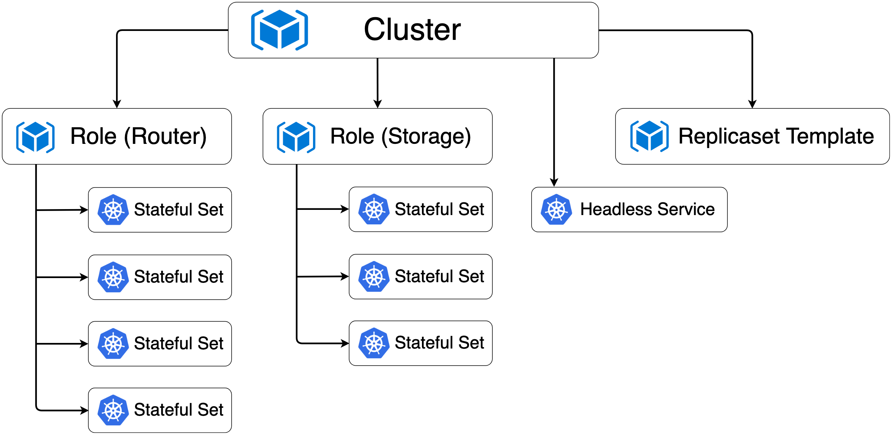
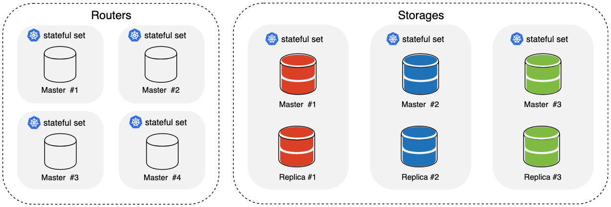
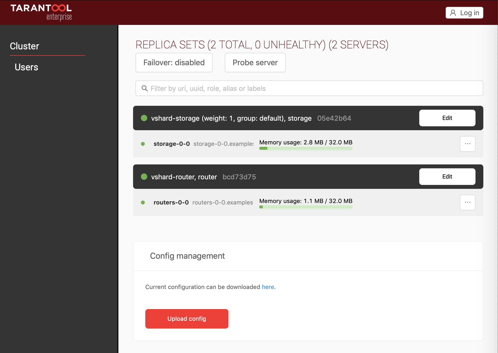

<a href="http://tarantool.org">
   
</a>

# Tarantool Kubernetes operator

[![Test][gh-actions-badge]][gh-actions-url]

The Tarantool Operator provides automation that simplifies the administration
of [Tarantool Cartridge](https://github.com/tarantool/cartridge)-based clusters
on Kubernetes.

The Operator introduces new API version `tarantool.io/v1alpha1` and installs
custom resources for objects of three custom types: Cluster, Role, and
ReplicasetTemplate.

## Table of contents

* [Resources](#resources)
* [Resource ownership](#resource-ownership)
* [Deploying the Tarantool operator on minikube](#deploying-the-tarantool-operator-on-minikube)
* [Example: key-value storage](#example-key-value-storage)
  * [Application topology](#application-topology)
  * [Running the application](#running-the-application)
  * [Scaling the application](#scaling-the-application)
  * [Running tests](#running-tests)

## Resources

**Cluster** represents a single Tarantool Cartridge cluster.

**Role** represents a Tarantool Cartridge user role.

**ReplicasetTemplate** is a template for StatefulSets created as members of Role.

## Resource ownership

Resources managed by the Operator being deployed have the following resource
ownership hierarchy:



Resource ownership directly affects how Kubernetes garbage collector works.
If you execute a delete command on a parent resource, then all its dependants
will be removed.

## Deploying the Tarantool operator on minikube

1. Install the required software:

    - [kubectl](https://kubernetes.io/docs/tasks/tools/install-kubectl)

    - [minikube](https://kubernetes.io/docs/tasks/tools/install-minikube/)

1. Create a `minikube` cluster:

    ```shell
    minikube start --memory=4096
    ```

    You will need 4Gb of RAM allocated to the `minikube` cluster to run examples.

    Ensure `minikube` is up and running:

    ```shell
    minikube status
    ```

    In case of success you will see this output:

    ```shell
    host: Running
    kubelet: Running
    apiserver: Running
    ```

1. Enable Ingress add-on:

    ```shell
    minikube addons enable ingress
    ```

1. Create operator resources:

    ```shell
    kubectl create -f deploy/service_account.yaml
    kubectl create -f deploy/role.yaml
    kubectl create -f deploy/role_binding.yaml
    ```

1. Create Tarantool Operator CRD's (Custom Resource Definitions):

    ```shell
    kubectl create -f deploy/crds/tarantool_v1alpha1_cluster_crd.yaml
    kubectl create -f deploy/crds/tarantool_v1alpha1_role_crd.yaml
    kubectl create -f deploy/crds/tarantool_v1alpha1_replicasettemplate_crd.yaml
    ```

1. Start the operator:

    ```shell
    kubectl create -f deploy/operator.yaml
    ```

    Ensure the operator is up:

    ```shell
    kubectl get pods --watch
    ```

    Wait for `tarantool-operator-xxxxxx-xx` Pod's status to become `Running`.

## Example: key-value storage

`examples/kv` contains a Tarantool-based distributed key-value storage.
Data are accessed via HTTP REST API.

### Application topology



### Running the application

We assume that commands are executed from the repository root and
Tarantool Operator is up and running.

1. Create a cluster:

    ```shell
    kubectl create -f examples/kv/deployment.yaml
    ```

   Wait until all the cluster Pods are up (status becomes `Running`):

     ```shell
     kubectl get pods --watch
     ```

1.  Ensure cluster became operational:

    ```shell
    kubectl describe clusters.tarantool.io examples-kv-cluster
    ```

    wait until Status.State is Ready:

    ```shell
    ...
    Status:
      State:  Ready
    ...
    ```

1. Access the cluster web UI:

   1. Get `minikube` vm IP-address:

       ```shell
       minikube ip
       ```

   1. Open **http://MINIKUBE_IP** in your browser.
      Replace MINIKUBE_IP with the IP-address reported by the previous command.

      

> **_NOTE:_** Due to a recent
> [bug in Ingress](https://github.com/kubernetes/minikube/issues/2840),
> web UI may be inaccessible. If needed, you can try this
> [workaround](https://github.com/kubernetes/minikube/issues/2840#issuecomment-492454708).

1. Access the key-value API:

   1. Store some value:

       ```shell
       curl -XPOST http://MINIKUBE_IP/kv -d '{"key":"key_1", "value": "value_1"}'
       ```

       In case of success you will see this output:

       ```shell
       {"info":"Successfully created"}
       ```

   1. Access stored values:

       ```shell
       curl http://MINIKUBE_IP/kv_dump
       ```

       In case of success you will see this output:

       ```shell
       {"store":[{"key":"key_1","value":"value_1"}]}
       ```

### Scaling the application

1. Increase the number of replica sets in Storages Role:

    ```shell
    kubectl edit roles.tarantool.io storage
    ```

    This will open the resource in a text editor.
    Change `spec.numReplicasets` field value to 3:

    ```shell
    spec:
      numReplicasets: 3
    ```

    Save your changes and exit the editor.

    This will add new replica sets to the existing cluster.

    View the new cluster topology via the cluster web UI.

1. Increase the number of replicas across all Storages Role replica sets:

    ```shell
    kubectl edit replicasettemplates.tarantool.io storage-template
    ```

    This will open the resource in a text editor.
    Change `spec.replicas` field value to 3:

    ```shell
    spec:
      replicas: 3
    ```

    Save your changes and exit the editor.

    This will add one more replica to each Storages Role replica set.

    View the new cluster topology via the cluster web UI.

> **_NOTE:_** When `kubectl` 1.16 is out, you will be able to scale the
> application with a single `kubectl scale` command, for example
> `kubectl scale roles.tarantool.io storage --replicas=3`.
> With younger versions of `kubectl` this is impossible due to
> [this bug](https://github.com/kubernetes/kubernetes/issues/80515).

### Running tests

```shell
make build
make start
./bootstrap.sh
make test
```

[gh-actions-badge]: https://github.com/tarantool/tarantool-operator/workflows/Test/badge.svg
[gh-actions-url]: https://github.com/tarantool/tarantool-operator/actions
