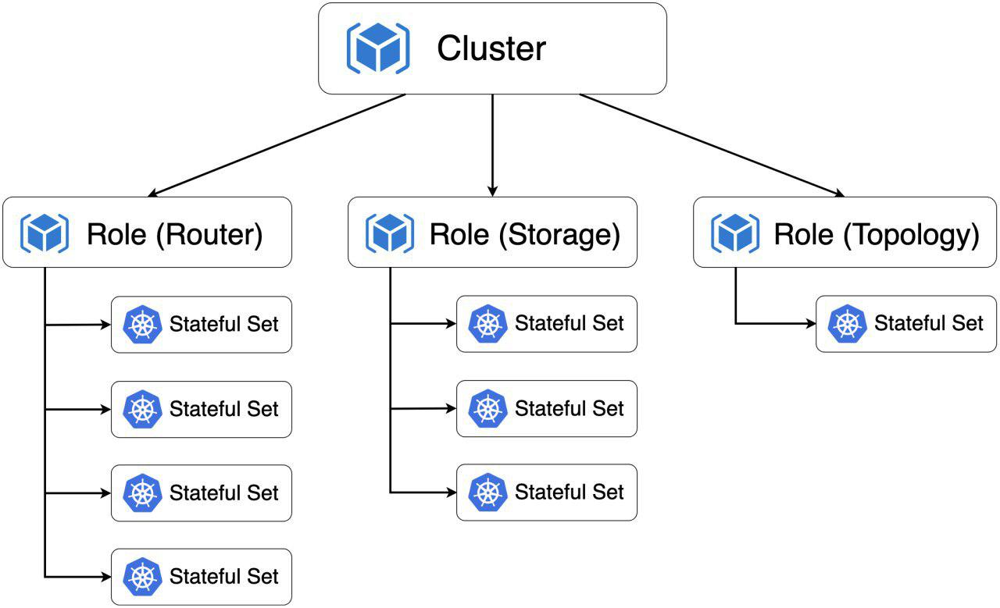

# Tarantool Kubernetes Operator

The Tarantool Operator provides automation that simplifies the administration of Tarantool Cartridge based clusters on Kubernetes.

The Operator instroduces new API version tarantool.io/v1alpha1 and installs custom resources to for objects of custom types Cluster, Role, ReplicasetTemplate.


### Resources

**Cluster** - represents single Tarantool Cartridge cluster

**Role** - represents Tarantool Cartridge user role

**ReplicasetTemplate** - is a template for StatefulSet's created as a members of Role

### Resource ownerhip

Resources managed by Operator being deployed forms resource ownership hierarchy:



Resource ownership directly affects how k8s garbage collector works. If you execute delete command on parent resource then all it's dependants will be removed.

### Deploying Tarantool Operator on Minikube

1. Install required software:

    - [kubectl](https://kubernetes.io/docs/tasks/tools/install-kubectl)

    - [minikube](https://kubernetes.io/docs/tasks/tools/install-minikube/)


1. Create minikube cluster

    ```shell
    minikube start --memory=4096
    ```

    You will need 4Gb of RAM allocated to minikube cluster to run examples

    Ensure Minikube is up and running:

    ```shell
    minikube status
    ```

    in case of success you will see output

    ```shell
    host: Running
    kubelet: Running
    apiserver: Running
    ```

1. Create operator resources

    ```shell
    kubectl create -f deploy/service_account.yaml
    kubectl create -f deploy/role.yaml
    kubectl create -f deploy/role_binding.yaml
    ```

1. Create Tarantool Operator CRD's

    ```shell
    kubectl create -f deploy/crds/tarantool_v1alpha1_cluster_crd.yaml
    kubectl create -f deploy/crds/tarantool_v1alpha1_role_crd.yaml
    kubectl create -f deploy/crds/tarantool_v1alpha1_replicasettemplate_crd.yaml
    ```

1. Start operator

    ```shell
    kubectl create -f deploy/operator.yaml
    ```

    ensure operator is up 

    ```shell
    kubectl get pods --watch
    ```

    wait for tarantool-operator-xxxxxx-xx Pod's STATUS became Runnning

### Examples

[Distributed key value storage](/examples/kv)
