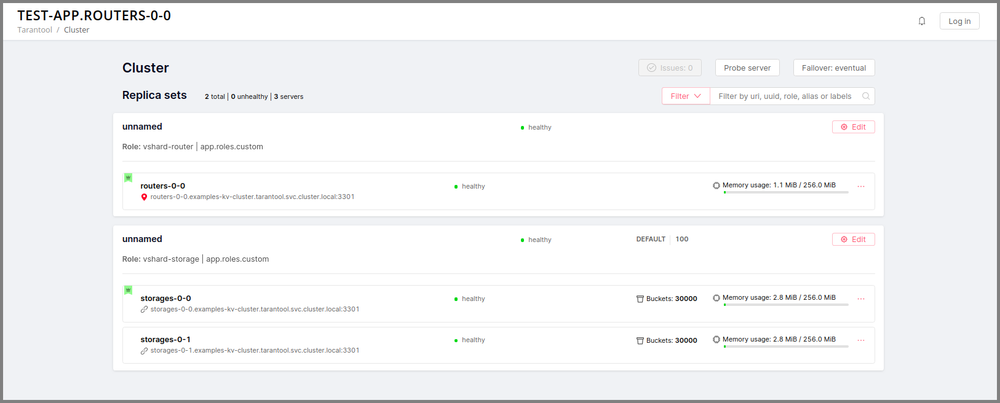
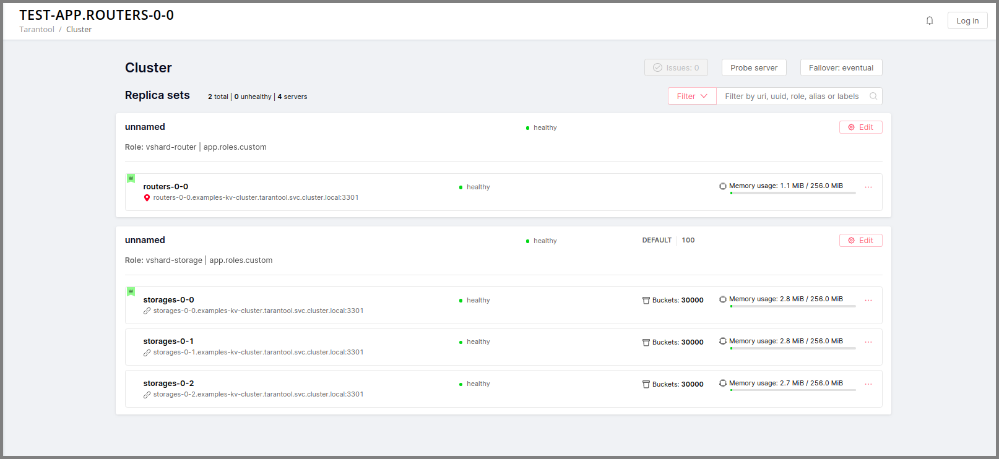
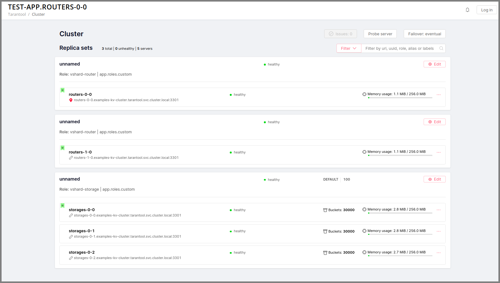
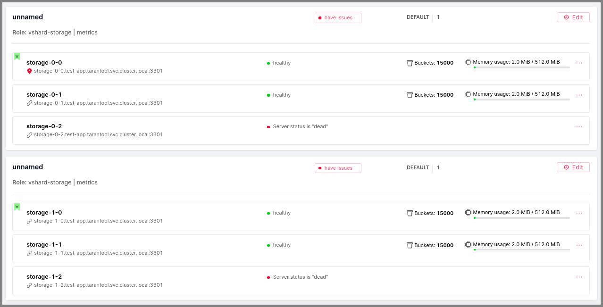

.. _cartridge_kubernetes_guide:

================================================================================
Tarantool Cartridge on Kubernetes
================================================================================

This guide covers the full life cycle of a Tarantool Cartridge app--from
developing the app to operating it on Kubernetes.

.. contents::

.. _cartridge_kubernetes_installing_tools:

--------------------------------------------------------------------------------
Installation tools
--------------------------------------------------------------------------------

The following tools are needed:

1. **cartridge-cli** is a utility for managing Cartridge applications.
   We need the version 2.3.0 or higher. Installation instructions are available
   `here <https://github.com/tarantool/cartridge-cli#installation>`_.
   If the installation is successful, the *cartridge* utility will be available
   in the system.

   .. code-block:: console

      $ cartridge version
      ---
      Tarantool Cartridge CLI v2.3.0 linux/amd64 commit: 06a5dad

2. **kubectl** is a Kubernetes cluster management tool. We need the
   version 1.16 or higher. Installation instructions can be found
   `here <https://kubernetes.io/docs/tasks/tools/install-kubectl/>`_.

   .. code-block:: console

      $ kubectl version --client
      ---
      Client Version: version.Info{Major:"1", Minor:"16", GitVersion:"v1.16.0", GitCommit:"2bd9643cee5b3b3a5ecbd3af49d09018f0773c77", GitTreeState:"clean", BuildDate:"2019-09-18T14:36:53Z",     GoVersion:"go1.12.9", Compiler:"gc", Platform:"linux/amd64"}

3. **helm** is a package manager for Kubernetes apps. We need the
   version 3.3.x. Installation instructions can be found
   `here <https://helm.sh/docs/intro/install/>`_.

   .. code-block:: console

      $ helm version
      ---
      version.BuildInfo{Version:"v3.3.1", GitCommit:"249e5215cde0c3fa72e27eb7a30e8d55c9696144", GitTreeState:"clean", GoVersion:"go1.14.7"}

4. **minikube** is a tool for creating a local Kubernetes cluster. We
   need the version 1.12 or higher. Installation instructions can be found
   `here <https://minikube.sigs.k8s.io/docs/start/>`_.

   .. code-block:: console

      $ minikube version
      ---
      minikube version: v1.17.1
      commit: 043bdca07e54ab6e4fc0457e3064048f34133d7e

5. **kind** (optional) is another tool for creating a local cluster. It
   can be used instead of the minikube. We need the version 0.6.0 or higher. Installation instructions can be
   found
   `here <https://kind.sigs.k8s.io/docs/user/quick-start/#installation>`_.

   .. code-block:: console

      $ kind version
      ---
      kind v0.9.0 go1.15.2 linux/amd64

.. _cartridge_kubernetes_creating_an_application:

--------------------------------------------------------------------------------
Creating an application
--------------------------------------------------------------------------------

Let's create a Cartridge application named ``test-app`` using ``cartridge-cli``:

.. code-block:: console

   $ cartridge create --name test-app
   ---
      • Create application test-app
      • Generate application files
      • Initialize application git repository
      • Application "test-app" created successfully

In the ``test-app`` directory, we get the app created from a template:

.. code-block:: console

   $ ls test-app
   ---
   ...

   instances.yml
   test-app-scm-1.rockspec
   ...

The app is fully functional and can respond to the HTTP GET request ``/hello``.

.. NOTE::

   Check the cartridge version in *test-app-scm-1.rockspec*:

   .. code:: lua

      dependencies = {
          ...
          'cartridge == 2.3.0-1',
          ...
      }

   The version of Cartridge must be **>= 2.3.0**. Starting from this version,
   Cartridge waits for an instance to become available on its DNS address during
   the instance start. This is required for correct operations on Kubernetes. For
   versions below 2.3.0, an application must be customized independently.
   See the
   `example <https://github.com/tarantool/tarantool-operator/blob/master/examples/kv/key-value-store/init.lua#L27-L71>`_
   of how to do this.

~~~~~~~~~~~~~~~~~~~~~~~~~~~~~~~~~~~~~~~~~~~~~~~~~~~~~~~~~~~~~~~~~~~~~~~~~~~~~~~
Building the application
~~~~~~~~~~~~~~~~~~~~~~~~~~~~~~~~~~~~~~~~~~~~~~~~~~~~~~~~~~~~~~~~~~~~~~~~~~~~~~~

Let's create a Docker image using ``cartridge-cli``:

.. code-block:: console

   $ cartridge pack docker --tag vanyarock01/test-app:0.1.0-0-g68f6117
   ---
   ...
   Running in 0ffbd57a0edf
   Removing intermediate container 0ffbd57a0edf
    ---> aceef7a3be63
    ---> aceef7a3be63
   Successfully built aceef7a3be63
   Successfully tagged test-app:0.1.0-0-g68f6117
      • Created result image test-app:0.1.0-0-g68f6117
      • Application was successfully packed

Upload the image to the Docker registry:

.. code-block:: console

   $ docker push vanyarock01/test-app:0.1.0-0-g68f6117
   ---
   The push refers to repository [docker.io/vanyarock01/test-app]
   b327b35afe0a: Pushed
   de30ed3f758d: Pushed
   3c8808fbd85d: Pushed
   291f6e44771a: Pushed
   0.1.0-0-g275baa8: digest: sha256:5b3b92a615b34c7f132e72e2d61f692cf2091ca28be27bbbfed98106398d1c19 size: 1160

.. NOTE::

   You must be logged in via ``docker login`` and have access rights
   to the target registry.

.. _cartridge_kubernetes_creating_a_kubernetes_cluster:

--------------------------------------------------------------------------------
Creating a Kubernetes cluster
--------------------------------------------------------------------------------

If you have a ready-made cluster in the cloud, you can use it. If not, we
suggest two ways of how to create a local cluster:

* using :ref:`minikube <cartridge_kubernetes_creating_cluster_minikube>`
* using :ref:`kind <cartridge_kubernetes_creating_cluster_kind>`.

.. _cartridge_kubernetes_creating_cluster_minikube:

~~~~~~~~~~~~~~~~~~~~~~~~~~~~~~~~~~~~~~~~~~~~~~~~~~~~~~~~~~~~~~~~~~~~~~~~~~~~~~~
Using *minikube*
~~~~~~~~~~~~~~~~~~~~~~~~~~~~~~~~~~~~~~~~~~~~~~~~~~~~~~~~~~~~~~~~~~~~~~~~~~~~~~~

Create a Kubernetes cluster of version 1.16.4 with 4GB of RAM (recommended):

.. code-block:: console

   $ minikube start --kubernetes-version v1.16.4 --memory 4096
   ---
   😄  minikube v1.17.1 on Ubuntu 18.10
   ✨  Automatically selected the docker driver. Other choices: kvm2, virtualbox, ssh
   👍  Starting control plane node minikube in cluster minikube
   🚜  Pulling base image ...
   🔥  Creating docker container (CPUs=2, Memory=4096MB) ...
   🐳  Preparing Kubernetes v1.16.4 on Docker 20.10.2 ...
       ▪ Generating certificates and keys ...
       ▪ Booting up control plane ...
       ▪ Configuring RBAC rules ...
   🔎  Verifying Kubernetes components...
   🌟  Enabled addons: storage-provisioner, default-storageclass
   🏄  Done! kubectl is now configured to use "minikube" cluster and "default" namespace by default

Wait for the cluster state to be *Ready*:

.. code-block:: console

   $ kubectl get nodes
   ---
   NAME       STATUS   ROLES    AGE   VERSION
   minikube   Ready    master   21m   v1.16.4

.. _cartridge_kubernetes_creating_cluster_kind:

~~~~~~~~~~~~~~~~~~~~~~~~~~~~~~~~~~~~~~~~~~~~~~~~~~~~~~~~~~~~~~~~~~~~~~~~~~~~~~~
Using *kind*
~~~~~~~~~~~~~~~~~~~~~~~~~~~~~~~~~~~~~~~~~~~~~~~~~~~~~~~~~~~~~~~~~~~~~~~~~~~~~~~

Create a Kubernetes cluster of version 1.16.4 by using the *kind* utility as an
alternative to *minikube*:

.. code-block:: console

   $ kind create cluster --image kindest/node:v1.16.4
   ---
   Creating cluster "kind" ...
    ✓ Ensuring node image (kindest/node:v1.16.4) 🖼
    ✓ Preparing nodes 📦
    ✓ Writing configuration 📜
    ✓ Starting control-plane 🕹️
    ✓ Installing CNI 🔌
    ✓ Installing StorageClass 💾
   Set kubectl context to "kind-kind"
   You can now use your cluster with:

   kubectl cluster-info --context kind-kind

   Not sure what to do next? 😅  Check out https://kind.sigs.k8s.io/docs/user/quick-start/

Let's check the cluster status:

.. code-block:: console

   $ kubectl get nodes
   ---
   NAME                 STATUS   ROLES    AGE   VERSION
   kind-control-plane   Ready    master   48s   v1.16.4

.. _cartridge_kubernetes_launch_the_application:

--------------------------------------------------------------------------------
Launch the application
--------------------------------------------------------------------------------

To install the Tarantool Kubernetes operator and deploy the cluster, we will use
the ``helm`` utility. Charts are published in our repository. Let’s add it:

.. code-block:: console

   $ helm repo add tarantool https://tarantool.github.io/tarantool-operator

Two charts are available in the repository:

.. code-block:: console

   $ helm search repo tarantool
   ---
   NAME                            CHART VERSION   APP VERSION DESCRIPTION
   tarantool/tarantool-operator    0.0.8           1.16.0      kubernetes tarantool operator
   tarantool/cartridge             0.0.8           1.0         A Helm chart for tarantool

The ``tarantool/tarantool-operator`` chart installs and configures the
operator that manages Tarantool Cartridge clusters.

The ``tarantool/cartridge`` chart is a template for creating Tarantool
Cartridge clusters. With the default settings, this chart deploys an
example application consisting of 3 instances. The chart works only in
conjunction with the Tarantool Kubernetes operator.

.. NOTE::

   Use the same version with both charts. If you set the ``tarantool-operator``
   chart to version 0.0.8, set the ``cartridge`` chart to the same version 0.0.8.

Install *tarantool-operator* in the *tarantool* namespace:

.. code-block:: console

   $ helm install tarantool-operator tarantool/tarantool-operator --namespace tarantool --create-namespace --version 0.0.8
   ---
   NAME: tarantool-operator
   LAST DEPLOYED: Sun Sep 13 23:29:28 2020
   NAMESPACE: tarantool
   STATUS: deployed
   REVISION: 1
   TEST SUITE: None

Let's wait until a pod with the operator is ready to work:

.. code-block:: console

   $ kubectl get pods -n tarantool
   ---
   NAME                                 READY   STATUS    RESTARTS   AGE
   tarantool-operator-xxx-yyy           0/1     Pending   0          3s

In the meantime, let’s talk about what the Tarantool operator is and why
it is needed.

~~~~~~~~~~~~~~~~~~~~~~~~~~~~~~~~~~~~~~~~~~~~~~~~~~~~~~~~~~~~~~~~~~~~~~~~~~~~~~~
Tarantool Kubernetes operator
~~~~~~~~~~~~~~~~~~~~~~~~~~~~~~~~~~~~~~~~~~~~~~~~~~~~~~~~~~~~~~~~~~~~~~~~~~~~~~~

This is a Kubernetes application that can manage Tarantool Cartridge
resources.

What does this mean for us?

We don't need to know how to perform administrative actions such as
joining a node or creating a replica set. The operator knows how to do
this better, and if you set the value for its desired system
configuration, it begins to bring the cluster to the desired state.

The Tarantool Kubernetes operator itself is an implementation of the Kubernetes
Operator design pattern. It offers the automation of work with user
resources using controllers that respond to various events and changes.

The following links can help you understand this pattern:

- `Official description on kubernetes.io <https://kubernetes.io/docs/concepts/extend-kubernetes/operator/>`_;
- `Overview from the creators of the pattern (CoreOS) <https://coreos.com/operators/>`_;
- `Post on Habr from Lamoda about the development of the operator <https://habr.com/ru/company/lamoda/blog/446648/>`_.

In the meantime, our pod with ``tarantool-operator`` went into a *Running*
state. The next step is to install the app using the ``tarantool/cartridge``
helm chart. To do this, prepare a description of the desired system.

~~~~~~~~~~~~~~~~~~~~~~~~~~~~~~~~~~~~~~~~~~~~~~~~~~~~~~~~~~~~~~~~~~~~~~~~~~~~~~~
Deploying a Tarantool Cartridge application
~~~~~~~~~~~~~~~~~~~~~~~~~~~~~~~~~~~~~~~~~~~~~~~~~~~~~~~~~~~~~~~~~~~~~~~~~~~~~~~

After you have deployed the cluster and installed the operator, you can
move to the next step--launching the app.

We will deploy the app using the ``tarantool/cartridge`` chart. This is
a template. Run it with the default settings and get our example application
that has 3 instances. If you define your own settings, you can deploy any
application of any topology using the Tarantool Cartridge.

Let's have a look at the settings in the ``values.yaml`` file.
Comments provide a description of each parameter:

.. code-block:: yaml

   # Environment name and cluster name
   ClusterEnv: "dev"
   ClusterName: "test-app"

   # Docker image of the application
   image:
     repository: "vanyarock01/test-app"
     tag: "0.1.0-0-g68f6117"
     pullPolicy: "IfNotPresent"

   # The cluster topology includes a description of the number and
   # characteristics of replicasets and is described in the RoleConfig section.

   # For example, we want to create a cluster containing two types of replicasets:
   # routers and storages:
   RoleConfig:
     - RoleName: "routers" # Name of the replicaset type
       ReplicaCount: 1     # Number of replicas in the replicaset
       ReplicaSetCount: 1  # Number of replicasets for this role
       DiskSize: "1Gi"     # Persistent storage size
       CPUallocation: 0.1  # Part of vCPUs allocated for each container
       MemtxMemoryMB: 256  # Size of RAM allocated for each container
       RolesToAssign:      # Cartridge roles
         - "app.roles.custom"
         - "vshard-router"

     - RoleName: "storages"
       ReplicaCount: 2
       ReplicaSetCount: 1
       DiskSize: "1Gi"
       CPUallocation: 0.1
       MemtxMemoryMB: 256
       RolesToAssign:
         - "app.roles.custom"
         - "vshard-storage"

With this configuration we will get the following:

*  A Tarantool Cartridge cluster called ``test-app``.
*  Two replica sets in the cluster: ``routers`` and ``storages``.
*  One Tarantool instance in the ``routers`` replica set.
*  Two instances, master and replica, in the ``storages`` replica set.
*  Each replica set performs the roles listed in the ``RolesToAssign`` parameter.

Install the app:

.. code-block:: console

   $ helm install -f values.yaml test-app tarantool/cartridge --namespace tarantool --version 0.0.8
   ---
   NAME: test-app
   LAST DEPLOYED: Mon Sep 14 10:46:50 2020
   NAMESPACE: tarantool
   STATUS: deployed
   REVISION: 1

Let's wait for all the pods to launch:

.. code-block:: console

   $ kubectl -n tarantool get pods
   NAME                         READY   STATUS    RESTARTS   AGE
   routers-0-0                  0/1     Running   0          10s
   storages-0-0                 1/1     Running   0          10s
   ...
   tarantool-operator-xxx-yyy   1/1     Running   0          2m

To check the cluster, we forward ports from one of the pods and go to
the Cartridge dashboard:

..  code-block:: console

    $ kubectl port-forward -n tarantool routers-0-0 8081:8081

Now the Tarantool Cartridge Web UI is available at ``http://localhost:8081``.

.. _cartridge_kubernetes_cluster_management:

--------------------------------------------------------------------------------
Cluster management
--------------------------------------------------------------------------------

~~~~~~~~~~~~~~~~~~~~~~~~~~~~~~~~~~~~~~~~~~~~~~~~~~~~~~~~~~~~~~~~~~~~~~~~~~~~~~~
Adding a new replica
~~~~~~~~~~~~~~~~~~~~~~~~~~~~~~~~~~~~~~~~~~~~~~~~~~~~~~~~~~~~~~~~~~~~~~~~~~~~~~~

To increase the number of replicas in a replica set:

1. Change the configuration in the ``values.yaml`` file.
2. Update the app using the ``helm upgrade`` command.

The ``ReplicaCount`` parameter is responsible for the number of instances
in a replica set. Set it to ``3`` for the ``storages`` replica set:

.. code:: yaml

   - RoleName: "storages"
     ReplicaCount: 3
     ReplicaSetCount: 1
     DiskSize: "1Gi"
     CPUallocation: 0.10
     MemtxMemoryMB: 256
     RolesToAssign: "custom.vshard-storage"

Update the app:

.. code-block:: console

   $ helm upgrade -f values.yaml test-app tarantool/cartridge --namespace tarantool
   ---
   Release "test-app" has been upgraded. Happy Helming!
   NAME: test-app
   LAST DEPLOYED: Tue Sep 15 10:35:55 2020
   NAMESPACE: tarantool
   STATUS: deployed
   REVISION: 2

Let's wait until all the new pods go into the **Running** state and are
displayed in the Cartridge Web UI.

The ``storages`` replica set has 3 instances: 1 master and 2 replicas.

~~~~~~~~~~~~~~~~~~~~~~~~~~~~~~~~~~~~~~~~~~~~~~~~~~~~~~~~~~~~~~~~~~~~~~~~~~~~~~~
Adding a shard (replica set)
~~~~~~~~~~~~~~~~~~~~~~~~~~~~~~~~~~~~~~~~~~~~~~~~~~~~~~~~~~~~~~~~~~~~~~~~~~~~~~~

The ``ReplicaSetCount`` parameter defines the number of replicas of the same
type.

Let's increase the number of the ``routers`` replica sets to ``2``:

.. code:: yaml

   - RoleName: "routers"
     ReplicaCount: 1
     ReplicaSetCount: 2
     DiskSize: "1Gi"
     CPUallocation: 0.10
     MemtxMemoryMB: 256
     RolesToAssign: "custom.vshard-router"

Update the app:

.. code-block:: console

   $ helm upgrade -f values.yaml test-app tarantool/cartridge --namespace tarantool
   ---
   Release "test-app" has been upgraded. Happy Helming!
   NAME: test-app
   LAST DEPLOYED: Tue Sep 15 10:37:57 2020
   NAMESPACE: tarantool
   STATUS: deployed
   REVISION: 3

Let's wait for the new pod to start:

~~~~~~~~~~~~~~~~~~~~~~~~~~~~~~~~~~~~~~~~~~~~~~~~~~~~~~~~~~~~~~~~~~~~~~~~~~~~~~~
Updating application version
~~~~~~~~~~~~~~~~~~~~~~~~~~~~~~~~~~~~~~~~~~~~~~~~~~~~~~~~~~~~~~~~~~~~~~~~~~~~~~~

Currently, the app logic contains one HTTP endpoint ``/hello`` that returns
the string ``Hello world!`` in response to a GET request.

To check this out, let's forward the ports to the desired node:

.. code-block:: console

   $ kubectl port-forward -n tarantool routers-0-0 8081:8081
   ---
   Forwarding from 127.0.0.1:8081 -> 8081
   Forwarding from [::1]:8081 -> 8081

And then execute the request:

.. code-block:: console

   $ curl http://localhost:8081/hello
   ---
   Hello world!

Let's add another endpoint that will return the string "Hello world, new
version of the app!". To do this, add another ``httpd:route`` in the
``init`` function in the ``app/roles/custom.lua`` role:

.. code:: lua

   local function init(opts) -- luacheck: no unused args
       ...
       -- new endpoint
       httpd:route({method = 'GET', path = '/v2/hello'}, function()
           return {body = 'Hello world, new version of the app!'}
       end)

       ...
   end

Pack the new version of the app:

.. code-block:: console

   $ cartridge pack docker --tag vanyarock01/test-app:0.1.0-1-g4577716

   ---

   ...
   Successfully tagged vanyarock01/test-app:0.1.0-1-g4577716
      • Created result image vanyarock01/test-app:0.1.0-1-g4577716
      • Application was successfully packed

Upload the new image version to the Docker registry:

.. code-block:: console

   $ docker push vanyarock01/test-app:0.1.0-1-g4577716

Update the ``values.yaml`` configuration file by specifying a new ``image.tag``:

.. code:: yaml

   image:
     repository: "vanyarock01/test-app"
     tag: "0.1.0-1-g4577716"
     pullPolicy: "IfNotPresent"

Update the app on Kubernetes:

.. code-block:: console

   $ helm upgrade -f values.yaml test-app tarantool/cartridge --namespace tarantool

   ---

   Release "test-app" has been upgraded. Happy Helming!
   NAME: test-app
   LAST DEPLOYED: Tue Sep 15 10:45:53 2020
   NAMESPACE: tarantool
   STATUS: deployed
   REVISION: 4

Tarantool Kubernetes operator uses the **OnDelete** update policy. This means
that the update has reached the cluster, but the pods will update the app
image only after a restart:

.. code-block:: console

   $ kubectl delete pods -l tarantool.io/cluster-id=test-app -n tarantool
   ---
   pod "routers-0-0" deleted
   pod "routers-1-0" deleted
   pod "storages-0-0" deleted
   pod "storages-0-1" deleted
   pod "storages-0-2" deleted

Lets wait for the pods to start again and check the update:

.. code-block:: console

   $ kubectl port-forward -n tarantool routers-0-0 8081:8081
   ---
   Forwarding from 127.0.0.1:8081 -> 8081
   Forwarding from [::1]:8081 -> 8081
   ...

.. code-block:: console

   curl http://localhost:8081/v2/hello
   ---
   Hello world, new version of the app!

~~~~~~~~~~~~~~~~~~~~~~~~~~~~~~~~~~~~~~~~~~~~~~~~~~~~~~~~~~~~~~~~~~~~~~~~~~~~~~~
Running multiple Tarantool Cartridge clusters in different namespaces
~~~~~~~~~~~~~~~~~~~~~~~~~~~~~~~~~~~~~~~~~~~~~~~~~~~~~~~~~~~~~~~~~~~~~~~~~~~~~~~

Tarantool Kubernetes operator can manage Tarantool Cartridge clusters only in its
own namespace. Therefore, to deploy multiple Cartridge clusters in
different namespaces you need to deploy an operator in each of them.

To install an operator in several namespaces, just specify the required
namespace during installation:

.. code-block:: console

   $ helm install tarantool-operator tarantool/tarantool-operator --namespace NS_1 --create-namespace --version 0.0.8

   $ helm install tarantool-operator tarantool/tarantool-operator --namespace NS_2 --create-namespace --version 0.0.8

These commands set the operator to the namespace ``NS_1`` and the namespace
``NS_2``. Then, in each of them, you can run a Tarantool Cartridge
cluster.

.. code-block:: console

   $ helm install -f values.yaml cartridge tarantool/cartridge --namespace NS_1 --version 0.0.8

   $ helm install -f values.yaml cartridge tarantool/cartridge --namespace NS_2 --version 0.0.8

Finally, we have two namespaces. Each has an operator and a Tarantool Cartridge
cluster.

~~~~~~~~~~~~~~~~~~~~~~~~~~~~~~~~~~~~~~~~~~~~~~~~~~~~~~~~~~~~~~~~~~~~~~~~~~~~~~~
Deleting a cluster
~~~~~~~~~~~~~~~~~~~~~~~~~~~~~~~~~~~~~~~~~~~~~~~~~~~~~~~~~~~~~~~~~~~~~~~~~~~~~~~

To remove a cluster, execute the following command:

.. code-block:: console

   $ helm uninstall test-app --namespace tarantool
   ---
   release "test-app" uninstalled

After a while, all the pods of our application will disappear. Among the
pods in the ``tarantool`` namespace, only the Tarantool Kubernetes operator will
remain.

.. code-block:: console

   $ kubectl get pods -n tarantool
   ---
   NAME                                  READY   STATUS    RESTARTS   AGE
   tarantool-operator-xxx-yyy            1/1     Running   0          9m45s

If you need to remove the Tarantool Kubernetes operator, execute:

.. code-block:: console

   $ helm uninstall tarantool-operator --namespace tarantool
   ---
   release "tarantool-operator" uninstalled

.. NOTE::

   ``helm uninstall`` does not remove persistent volumes. To remove
   them, you need to additionally perform the following:

   .. code-block:: console

      $ kubectl delete pvc --all -n tarantool
      ---
      persistentvolumeclaim "www-routers-0-0" deleted
      persistentvolumeclaim "www-routers-1-0" deleted
      persistentvolumeclaim "www-storages-0-0" deleted

.. _cartridge_kubernetes_cluster_management_failover:

~~~~~~~~~~~~~~~~~~~~~~~~~~~~~~~~~~~~~~~~~~~~~~~~~~~~~~~~~~~~~~~~~~~~~~~~~~~~~~~
Failover
~~~~~~~~~~~~~~~~~~~~~~~~~~~~~~~~~~~~~~~~~~~~~~~~~~~~~~~~~~~~~~~~~~~~~~~~~~~~~~~

Failover - replicaset leader selection mechanism. You can read more about it `here <https://www.tarantool.io/en/doc/latest/book/cartridge/topics/failover/>`_.

.. NOTE::

   The ability to configure failover via kubernetes manifests will appear later

********************************************************************************
Eventual mode
********************************************************************************

Default mode. Uses SWIM protocol to detect failures.

********************************************************************************
Stateful mode
********************************************************************************

Uses external storage for coordination. To work, you need to enable a ``failover-coordinator`` role on several instances.

To do this, add the role in *values.yml* to the description of the replicasets:

.. code-block:: yaml

    RoleConfig:
       ...
      - RoleName: storage
        ReplicaCount: 1
        ReplicaSetCount: 1
        DiskSize: 1Gi
        CPUallocation: 0.1
        MemtxMemoryMB: 256
        RolesToAssign:
          - vshard-storage
          - metrics
          - failover-coordinator # added role

.. NOTE::

   Ability to update the roles is available in the Tarantool operator version later than 0.0.8

And run upgrading:

.. code-block:: console

   $ helm upgrade -f values.yaml test-app tarantool/cartridge --namespace tarantool 
   ---
   Release "test-app" has been upgraded. Happy Helming!
   NAME: test-app
   LAST DEPLOYED: Wed Feb  3 14:40:34 2021
   NAMESPACE: tarantool
   STATUS: deployed
   REVISION: 2

After we have at least one active role ``failover-coordinator``, we can enable stateful mode. It has two state providers: etcd and stateboard.

++++++++++++++++++++++++++++++++++++++++++++++++++++++++++++++++++++++++++++++++
etcd
++++++++++++++++++++++++++++++++++++++++++++++++++++++++++++++++++++++++++++++++

The etcd cluster is deployed independently, if you don't have it - the easiest way to install etcd is `etcd-operator <https://github.com/helm/charts/tree/master/stable/etcd-operator>`_ with helm chart.

We'll need a list of available etc cluster IP`s, the prefix for storage keys and credentials (user name and password).

How to set up stateful failover can be found on the documentation `page <https://www.tarantool.io/en/doc/latest/book/cartridge/topics/failover/#failover-configuration>`_.

++++++++++++++++++++++++++++++++++++++++++++++++++++++++++++++++++++++++++++++++
Stateboard
++++++++++++++++++++++++++++++++++++++++++++++++++++++++++++++++++++++++++++++++

How to install a stateboard can be found on this documentation `page <https://www.tarantool.io/en/doc/latest/book/cartridge/topics/failover/#stateboard-configuration>`_.

.. _cartridge_kubernetes_troubleshooting:

--------------------------------------------------------------------------------
Troubleshooting
--------------------------------------------------------------------------------

When creating, updating, or scaling a cluster, errors may occur due to
lack of physical resources.

Let's examine possible error indications, root causes and solutions.

~~~~~~~~~~~~~~~~~~~~~~~~~~~~~~~~~~~~~~~~~~~~~~~~~~~~~~~~~~~~~~~~~~~~~~~~~~~~~~~
Insufficient CPU
~~~~~~~~~~~~~~~~~~~~~~~~~~~~~~~~~~~~~~~~~~~~~~~~~~~~~~~~~~~~~~~~~~~~~~~~~~~~~~~

After executing ``helm install / upgrade`` the pods remain in the
**Pending** state.

It looks like this:

.. code-block:: console

   $ kubectl get pods -n tarantool
   ---
   NAME                                  READY   STATUS    RESTARTS   AGE
   routers-0-0                           0/1     Pending   0          20m
   routers-1-0                           0/1     Pending   0          20m
   storages-0-0                          0/1     Pending   0          20m
   tarantool-operator-xxx-yyy            1/1     Running   0          23m

Let's take a look at the events of one of the pending pods:

.. code-block:: console

   $ kubectl -n tarantool describe pods routers-0-0
   ---
   Events:
     Type     Reason             Age                    From                Message
     ----     ------             ----                   ----                -------
     Warning  FailedScheduling   34m                    default-scheduler   0/2 nodes are available: 2 Insufficient cpu.
     Warning  FailedScheduling   34m                    default-scheduler   0/2 nodes are available: 2 Insufficient cpu.
     Normal   NotTriggerScaleUp  3m33s (x175 over 34m)  cluster-autoscaler  pod didn't trigger scale-up (it wouldn't fit if a new node is added):

It is now clear that we don't have enough CPU. You can reduce the
allocated CPU size in the ``values.yaml`` configuration file--the
``CPUallocation`` parameter.

~~~~~~~~~~~~~~~~~~~~~~~~~~~~~~~~~~~~~~~~~~~~~~~~~~~~~~~~~~~~~~~~~~~~~~~~~~~~~~~
Insufficient disk space
~~~~~~~~~~~~~~~~~~~~~~~~~~~~~~~~~~~~~~~~~~~~~~~~~~~~~~~~~~~~~~~~~~~~~~~~~~~~~~~

After executing ``helm install/upgrade`` the pods remain in the
**ContainerCreating** state. Let's take a look at the events:

.. code-block:: console

   $ kubectl -n tarantool describe pods routers-0-0
   ---
   Events:
     Type     Reason                  Age                  From                                              Message
     ----     ------                  ----                 ----                                              -------
     Warning  FailedScheduling        7m44s                default-scheduler                                 pod has unbound immediate PersistentVolumeClaims
     Warning  FailedScheduling        7m44s                default-scheduler                                 pod has unbound immediate PersistentVolumeClaims
     Normal   Scheduled               7m42s                default-scheduler                                 Successfully assigned tarantool/routers-0-0 to kubernetes-cluster-3010-default-group-0
     Normal   SuccessfulAttachVolume  7m37s                attachdetach-controller                           AttachVolume.Attach succeeded for     volume "pvc-e0d3f30a-7dcc-4a67-a69d-4670dc77d556"
     Warning  FailedMount             67s (x9 over 7m5s)   kubelet, kubernetes-cluster-3010-default-group-0  MountVolume.MountDevice failed for volume "pvc-e0d3f30a-7dcc-4a67-a69d-4670dc77d556" : rpc error: code = Internal desc = Unable to find Device path for volume
     Warning  FailedMount             66s (x3 over 5m38s)  kubelet, kubernetes-cluster-3010-default-group-0  Unable to attach or mount volumes: unmounted volumes=[www], unattached volumes=[www default-token-jrz94]: timed out waiting for the condition

Such events indicate that there is not enough disk space to create
storages. You can change the size of the allocated memory using the
``DiskSize`` parameter in the *values.yaml* file for replica sets. The
error can also be resolved by increasing the size of the physical
cluster disk.

~~~~~~~~~~~~~~~~~~~~~~~~~~~~~~~~~~~~~~~~~~~~~~~~~~~~~~~~~~~~~~~~~~~~~~~~~~~~~~~
CrashLoopBackOff status
~~~~~~~~~~~~~~~~~~~~~~~~~~~~~~~~~~~~~~~~~~~~~~~~~~~~~~~~~~~~~~~~~~~~~~~~~~~~~~~

Pods do not start and have the status ``CrashLoopBackOff``. In short,
this means that the container starts and crashes soon after due to an
error in the code.

.. code-block:: console

   $ kubectl -n tarantool get pods
   ---
   NAME                                 READY   STATUS             RESTARTS   AGE
   routers-0-0                           0/1     CrashLoopBackOff   6          8m4s
   storages-0-0                          0/1     CrashLoopBackOff   6          8m4s
   tarantool-operator-b54fcb6f9-2xzpn    1/1     Running            0          12m 

Doing a kubectl describe pod will give us more information on that pod:

.. code-block:: console

   $ kubectl -n tarantool describe pod routers-0-0
   ---
   Events:
     Type     Reason            Age                    From               Message
     ----     ------            ----                   ----               -------
     ...
     Normal   Pulling           39m                    kubelet, minikube  Pulling image "vanyarock01/test-app:0.1.0-1-g4577716"
     Normal   Pulled            39m                    kubelet, minikube  Successfully pulled image "vanyarock01/test-app:0.1.0-1-g4577716"
     Normal   Created           37m (x5 over 39m)      kubelet, minikube  Created container pim-storage
     Normal   Pulled            37m (x4 over 39m)      kubelet, minikube  Container image "vanyarock01/test-app:0.1.0-1-g4577716" already present on machine
     Normal   Started           37m (x5 over 39m)      kubelet, minikube  Started container pim-storage
     Warning  BackOff           4m25s (x157 over 38m)  kubelet, minikube  Back-off restarting failed container

We see that the container cannot start. Rather, the container starts,
but after starting it stops due to an internal error. To understand what
is happening to him, let's see it's logs:

.. code-block:: console

   $ kubectl -n tarantool logs routers-0-0
   ---
   2021-02-28 15:18:59.866 [1] main/103/init.lua I> Using advertise_uri "routers-0-0.test-app.tarantool.svc.cluster.local:3301"
   2021-02-28 15:18:59.866 [1] main/103/init.lua I> Membership encryption enabled
   2021-02-28 15:18:59.963 [1] main/103/init.lua I> Probe uri was successful
   2021-02-28 15:18:59.964 [1] main/103/init.lua I> Membership BROADCAST sent to 127.0.0.1:3302
   2021-02-28 15:19:00.061 [1] main/103/init.lua I> Membership BROADCAST sent to 172.17.255.255:3302
   2021-02-28 15:19:00.062 [1] main/103/init.lua I> Membership BROADCAST sent to 127.0.0.1:3301
   2021-02-28 15:19:00.063 [1] main/103/init.lua I> Membership BROADCAST sent to 172.17.255.255:3301
   2021-02-28 15:19:00.064 [1] main/103/init.lua I> Membership BROADCAST sent to 127.0.0.1:3300
   2021-02-28 15:19:00.065 [1] main/103/init.lua I> Membership BROADCAST sent to 172.17.255.255:3300
   2021-02-28 15:19:00.066 [1] main/107/http/0.0.0.0:8081 I> started
   2021-02-28 15:19:00.069 [1] main/103/init.lua I> Listening HTTP on 0.0.0.0:8081
   2021-02-28 15:19:00.361 [1] main/108/remote_control/0.0.0.0:3301 I> started
   2021-02-28 15:19:00.361 [1] main/103/init.lua I> Remote control bound to 0.0.0.0:3301
   2021-02-28 15:19:00.362 [1] main/103/init.lua I> Remote control ready to accept connections
   2021-02-28 15:19:00.362 [1] main/103/init.lua I> Instance state changed:  -> Unconfigured
   2021-02-28 15:19:00.365 [1] main/103/init.lua I> server alias routers-0-0
   2021-02-28 15:19:00.365 [1] main/103/init.lua I> advertise uri routers-0-0.test-app.tarantool.svc.cluster.local:3301
   2021-02-28 15:19:00.365 [1] main/103/init.lua I> working directory /var/lib/tarantool/test-app.routers-0-0
   2021-02-28 15:19:00.365 [1] main utils.c:1014 E> LuajitError: /usr/share/tarantool/test-app/init.lua:42: unhandled error
   2021-02-28 15:19:00.365 [1] main F> fatal error, exiting the event loop

We see that the application crashes with an error: ``unhandled error``.
This is an example of an error. In reality, there can be any other error
that leads to the crash of the Tarantool instance. Fix the bug in the
application and update the application to the new version.

~~~~~~~~~~~~~~~~~~~~~~~~~~~~~~~~~~~~~~~~~~~~~~~~~~~~~~~~~~~~~~~~~~~~~~~~~~~~~~~
Recreating replicas
~~~~~~~~~~~~~~~~~~~~~~~~~~~~~~~~~~~~~~~~~~~~~~~~~~~~~~~~~~~~~~~~~~~~~~~~~~~~~~~

You may need to recreate the replicas: delete existing replicas,
create new ones and join them back to the replicaset.
Recreating replicas may be necessary when, for example, replication breaks down.

Let's see how to do this. For example, you have a ``storage`` role:

.. code-block:: yaml

   RoleConfig:
     ...

     - RoleName: storage
       ReplicaCount: 3
       ReplicaSetCount: 2
       DiskSize: 1Gi
       CPUallocation: 0.1
       MemtxMemoryMB: 512
       RolesToAssign:
         - vshard-storage

Based on this description, after installation you will have the following pods:

.. code-block:: console

   $ kubectl -n tarantool get pods
   NAME                                  READY   STATUS    RESTARTS   AGE
   ---
   ...
   storage-0-0                           1/1     Running   0          2m42s
   storage-0-1                           1/1     Running   0          106s
   storage-0-2                           1/1     Running   0          80s
   storage-1-0                           1/1     Running   0          2m42s
   storage-1-1                           1/1     Running   0          111s
   storage-1-2                           1/1     Running   0          83s
   tarantool-operator-7879d99ccb-6vrmg   1/1     Running   0          13m

Let's try to reduce the number of replicas in the storage replicaset. To do
so, change the ``ReplicaCount`` number for the ``storage`` role from ``3`` to ``2``
and run ``upgrade``:

.. code-block:: console

   $ helm upgrade -f values.yaml test-app tarantool/cartridge --namespace tarantool --version 0.0.8
   ---
   Release "test-app" has been upgraded. Happy Helming!
   NAME: test-app
   LAST DEPLOYED: Tue Mar  2 11:45:29 2021
   NAMESPACE: tarantool
   STATUS: deployed
   REVISION: 2

You will see that ``storage-0-2`` and ``storage-1-2`` become "Terminating"
and then disappear from the pods list:

.. code-block:: console

   $ kubectl -n tarantool get pods
   ---
   NAME                                  READY   STATUS        RESTARTS   AGE
   ...
   storage-0-0                           1/1     Running       0          12m
   storage-0-1                           1/1     Running       0          11m
   storage-0-2                           0/1     Terminating   0          11m
   storage-1-0                           1/1     Running       0          12m
   storage-1-1                           1/1     Running       0          11m
   storage-1-2                           0/1     Terminating   0          11m
   tarantool-operator-xxx-yyy            1/1     Running       0          17m

Let's check what the cluster looks like on the web UI:

.. code-block:: console

   $ kubectl -n tarantool port-forward storage-0-0 8081:8081
   ---
   Forwarding from 127.0.0.1:8081 -> 8081
   Forwarding from [::1]:8081 -> 8081

Here we have turned off every third replica of the ``storage`` role.
Note that we did not expel these replicas from the cluster. If we want to
return them and not lose data, return the required number of replicas
of the storage role and run ``upgrade`` again.

However, if you need to delete some replicas' data, you can delete
the corresponding :abbr:`PVC (persistent volume claim)` before upgrading.

.. code-block:: console

   $ kubectl -n tarantool get pvc
   ---
   NAME              STATUS   VOLUME                                     CAPACITY   ACCESS MODES   STORAGECLASS   AGE
   ...
   www-storage-0-0   Bound    pvc-729c4827-e10e-4ede-b546-c72642935441   1Gi        RWO            standard       157m
   www-storage-0-1   Bound    pvc-6b2cfed2-171f-4b56-b290-3013b8472039   1Gi        RWO            standard       156m
   www-storage-0-2   Bound    pvc-147b0505-5380-4419-8d86-97db6a74775c   1Gi        RWO            standard       156m
   www-storage-1-0   Bound    pvc-788ad781-343b-43fe-867d-44432b1eabee   1Gi        RWO            standard       157m
   www-storage-1-1   Bound    pvc-4c8b334e-cf49-411b-8c4f-1c97e9baa93e   1Gi        RWO            standard       156m
   www-storage-1-2   Bound    pvc-c67d32c0-7d7b-4803-908e-065150f31189   1Gi        RWO            standard       156m

It can be seen that the PVC pods that we deleted still exist. Let's remove data of the ``storage-1-2``:

.. code-block:: console
   
   $ kubectl -n tarantool delete pvc www-storage-1-2
   ---
   persistentvolumeclaim "www-storage-1-2" deleted

Now you need to return the value ``3`` in the ``ReplicaCount`` field of the storage role and run ``upgrade``:

.. code-block:: console

   $ helm upgrade -f values.yaml test-app tarantool/cartridge --namespace tarantool --version 0.0.8
   ---
   Release "test-app" has been upgraded. Happy Helming!
   NAME: test-app
   LAST DEPLOYED: Tue Mar  2 14:42:06 2021
   NAMESPACE: tarantool
   STATUS: deployed
   REVISION: 3

After a while, new pods will be up and configured.
The pod whose data was deleted may get stuck in the ``unconfigured``
state. If this happens, try to restart it:

.. code-block:: console

   $ kubectl -n tarantool delete pod storage-1-2
   ---
   pod "storage-1-2" deleted

Why does it work? The Tarantool operator does not expel nodes from the cluster,
but only "shuts them down". Therefore, it is impossible to reduce the
number of replicas in this way. But you can recreate it, since the UID
of each instance is generated based on its name, for example ``storage-1-2``.
This ensures that the new instance with the given name replaces the old one.

This method is recommended only when there is no other way.
It has its own limitations:

-   Restarting nodes is possible only in descending order of the number in the replicaset.
    If you have a replicaset with ``node-0-0``, ``node-0-1``, ``node-0-2``, and ``node-0-3``,
    and you want to recreate only ``node-0-1``, then the nodes ``node-0-1``, ``node-0-2``,
    and ``node-0-3`` will also restart with it.
-   All nodes that belong to the selected role will be restarted.
    It isn't possible to select a specific replicaset and only restart its instances.
-   If the replicaset leader number is more than the number of restarted replica,
    restarting can stop the leader.
    It will make the replicaset unable to receive new write requests.
    Please be very careful with reconnecting replicas.

.. _cartridge_kubernetes_customization:

--------------------------------------------------------------------------------
Customization
--------------------------------------------------------------------------------

For most cases, the ``tarantool/cartridge`` helm chart is enough for you.
However, if customization is required, you can continue to use the chart
by making your own changes. You can also ``deployment.yaml`` and ``kubectl`` instead
of ``helm``.

~~~~~~~~~~~~~~~~~~~~~~~~~~~~~~~~~~~~~~~~~~~~~~~~~~~~~~~~~~~~~~~~~~~~~~~~~~~~~~~
Sidecar containers
~~~~~~~~~~~~~~~~~~~~~~~~~~~~~~~~~~~~~~~~~~~~~~~~~~~~~~~~~~~~~~~~~~~~~~~~~~~~~~~

What are they? With Kubernetes, it is possible to create several
containers inside one pod that share common resources such as disk
storage and network interfaces. Such containers are called sidecar.

Learn more about this architectural pattern
`here <https://www.magalix.com/blog/the-sidecar-pattern>`_.

For implementation on Kubernetes, it is necessary to expand the
container park in the description of the required resource. Let's try to
add another service container with ``nginx`` to each pod containing a
container with a Tarantool instance based on
`this <https://kubernetes.io/docs/tasks/access-application-cluster/communicate-containers-same-pod-shared-volume/>`_
article.

To do this, you will need to change the ``tarantool/cartridge`` chart. You
can find it
`here <https://github.com/tarantool/tarantool-operator/tree/master/examples/kv/helm-chart>`_.
Add a new container with ``nginx`` to the ``ReplicasetTemplate`` which can be
found in the ``templates/deployment.yaml`` file.

.. code:: yaml

   containers:
   - name: "pim-storage"
     image: "{{ $.Values.image.repository }}:{{ $.Values.image.tag }}"
     ...
   - name: "nginx-container"
     image: "nginx"
     volumeMounts:
       - name: "www"
         mountPath: "/data"

.. NOTE::

   It is important to describe additional containers strictly
   after the pim-storage container. Otherwise, problems may occur when
   updating the version of the application.

   By default, the Tarantool Kubernetes operator
   chooses the first one in the list as the application container.

Now, let's start the installation specifying the path to the directory
with the customized chart:

.. code-block:: console

   $ helm install -f values.yaml test-app tarantool-operator/examples/kv/helm-chart/ --namespace tarantool
   ---
   NAME: test-app
   LAST DEPLOYED: Wed Sep 30 11:25:12 2020
   NAMESPACE: tarantool
   STATUS: deployed
   REVISION: 1

If everything goes well, it will be visible in the pod list:

.. code-block:: console

   $ kubectl -n tarantool get pods
   ---
   NAME                                  READY   STATUS    RESTARTS   AGE
   routers-0-0                           2/2     Running   0          113s
   routers-1-0                           2/2     Running   0          113s
   storages-0-0                          2/2     Running   0          113s
   tarantool-operator-xxx-yyy            1/1     Running   0          30m

``READY 2/2`` means that 2 containers are ready inside the pod.

.. _cartridge_kubernetes_installation_on_the_internal_network:

--------------------------------------------------------------------------------
Installation in an internal network
--------------------------------------------------------------------------------

~~~~~~~~~~~~~~~~~~~~~~~~~~~~~~~~~~~~~~~~~~~~~~~~~~~~~~~~~~~~~~~~~~~~~~~~~~~~~~~
Delivery of tools
~~~~~~~~~~~~~~~~~~~~~~~~~~~~~~~~~~~~~~~~~~~~~~~~~~~~~~~~~~~~~~~~~~~~~~~~~~~~~~~

We need to bring the ``tarantool-cartridge`` and ``tarantool-operator``
charts and the image of your application inside the internal network.

You can download the charts from the following links:

* `tarantool-operator v0.0.8 <https://github.com/tarantool/tarantool-operator/releases/download/tarantool-operator-0.0.8/tarantool-operator-0.0.8.tgz>`_
* `cartridge v0.0.8 <https://github.com/tarantool/tarantool-operator/releases/download/cartridge-0.0.8/cartridge-0.0.8.tgz>`_.

Next, you need to pack a Docker image with the ``tarantool-operator``.
First, let's pull the required version from the Docker Hub:

.. code-block:: console

   $ docker pull tarantool/tarantool-operator:0.0.8
   ---
   0.0.8: Pulling from tarantool/tarantool-operator
   3c72a8ed6814: Pull complete
   e6ffc8cffd54: Pull complete
   cb731cdf9a11: Pull complete
   a42b002f4072: Pull complete
   Digest: sha256:e3b46c2a0231bd09a8cdc6c86eac2975211b2c597608bdd1e8510ee0054a9854
   Status: Downloaded newer image for tarantool/tarantool-operator:0.0.8
   docker.io/tarantool/tarantool-operator:0.0.8

And pack it into the archive:

.. code-block:: console

   $ docker save tarantool/tarantool-operator:0.0.8 | gzip > tarantool-operator-0.0.8.tar.gz

After delivering the archive with the container to the target location,
you need to load the image to your Docker:

.. code-block:: console

   $ docker load < tarantool-operator-0.0.8.tar.gz
   ---
   Loaded image: tarantool/tarantool-operator:0.0.8

All that remains is to push the image to the internal Docker registry. We
will use an example Docker registry hosted on ``localhost:5000``:

.. code-block:: console

   $ docker tag tarantool/tarantool-operator:0.0.8 localhost:5000/tarantool-operator:0.0.8

   $ docker push localhost:5000/tarantool-operator:0.0.8
   ---
   The push refers to repository [localhost:5000/tarantool-operator]
   febd47bb69b9: Pushed
   bacec9f8c1dd: Pushed
   d1d164c2f681: Pushed
   291f6e44771a: Pushed
   0.0.8: digest: sha256:e3b46c2a0231bd09a8cdc6c86eac2975211b2c597608bdd1e8510ee0054a9854 size: 1155

.. NOTE::

   You can deliver the image with the application using the
   method described above.

~~~~~~~~~~~~~~~~~~~~~~~~~~~~~~~~~~~~~~~~~~~~~~~~~~~~~~~~~~~~~~~~~~~~~~~~~~~~~~~
Installing the Tarantool Kubernetes operator
~~~~~~~~~~~~~~~~~~~~~~~~~~~~~~~~~~~~~~~~~~~~~~~~~~~~~~~~~~~~~~~~~~~~~~~~~~~~~~~

Let's describe the custom operator values in the
``operator_values.yaml`` file:

.. code:: yaml

   image:
     # internal Docker repository
     repository: "localhost:5000/tarantool-operator"
     tag: "0.0.8"
     pullPolicy: "IfNotPresent"

And install the operator specifying the path to the archive with chart:

.. code-block:: console

   $ helm install tarantool-operator -f operator_values.yaml ./tarantool-operator-0.0.8.tgz --namespace tarantool --create-namespace
   ---
   NAME: tarantool-operator
   LAST DEPLOYED: Tue Dec  1 14:53:47 2020
   NAMESPACE: tarantool
   STATUS: deployed
   REVISION: 1
   TEST SUITE: None

Check the installation:

.. code-block:: console

   $ kubectl -n tarantool get pods
   ---
   NAME                                  READY   STATUS    RESTARTS   AGE
   tarantool-operator-xxx-yyy            1/1     Running   0          7s

~~~~~~~~~~~~~~~~~~~~~~~~~~~~~~~~~~~~~~~~~~~~~~~~~~~~~~~~~~~~~~~~~~~~~~~~~~~~~~~
Installing the Tarantool Cartridge app
~~~~~~~~~~~~~~~~~~~~~~~~~~~~~~~~~~~~~~~~~~~~~~~~~~~~~~~~~~~~~~~~~~~~~~~~~~~~~~~

We have pushed the app image to the local Docker registry beforehand. What
remains is to customize the ``values.yaml`` file by specifying the available
repository:

.. code:: yaml

   ...
   image:
     repository: "localhost:5000/test-app"
     tag: "0.1.0-0-g68f6117"
     pullPolicy: "IfNotPresent"
   ...

The complete configuration of the ``values.yaml`` can be found in the
instructions for installing the Tarantool Cartridge application
described in the guide earlier.

It remains to unpack the Cartridge chart:

.. code-block:: console

   $ tar -xzf tarantool-operator-cartridge-0.0.8.tar.gz

And run the installation by specifying the path to the chart:

.. code-block:: console

   $ helm install -f values.yaml test-app tarantool-operator-cartridge-0.0.8/examples/kv/helm-chart/ --namespace tarantool
   ---
   NAME: test-app
   LAST DEPLOYED: Tue Dec  1 15:52:41 2020
   NAMESPACE: tarantool
   STATUS: deployed
   REVISION: 1

Let's take a look at the pods to make sure the installation is
successful:

.. code-block:: console

   $ kubectl -n tarantool get pods
   ---
   NAME                                  READY   STATUS    RESTARTS   AGE
   routers-0-0                           1/1     Running   0          8m30s
   storages-0-0                          1/1     Running   0          8m30s
   storages-1-0                          1/1     Running   0          8m30s
   tarantool-operator-xxx-yyy            1/1     Running   0          67m

.. |image2| image:: images/kubernetes-increase-cluster-replicas.png
.. |image3| image:: images/kubernetes-increase-cluster-replicasets.png
